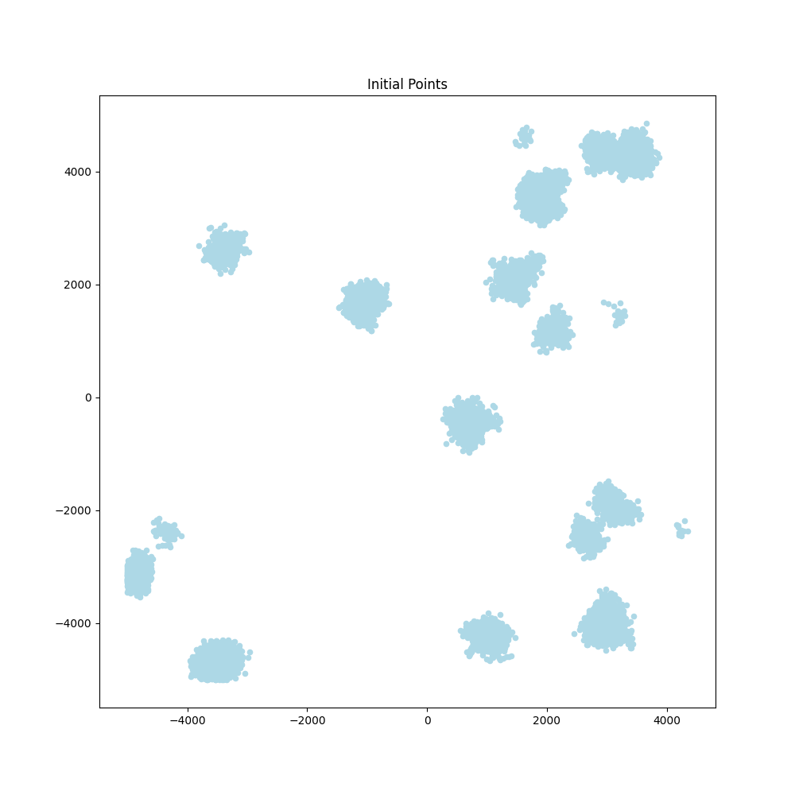
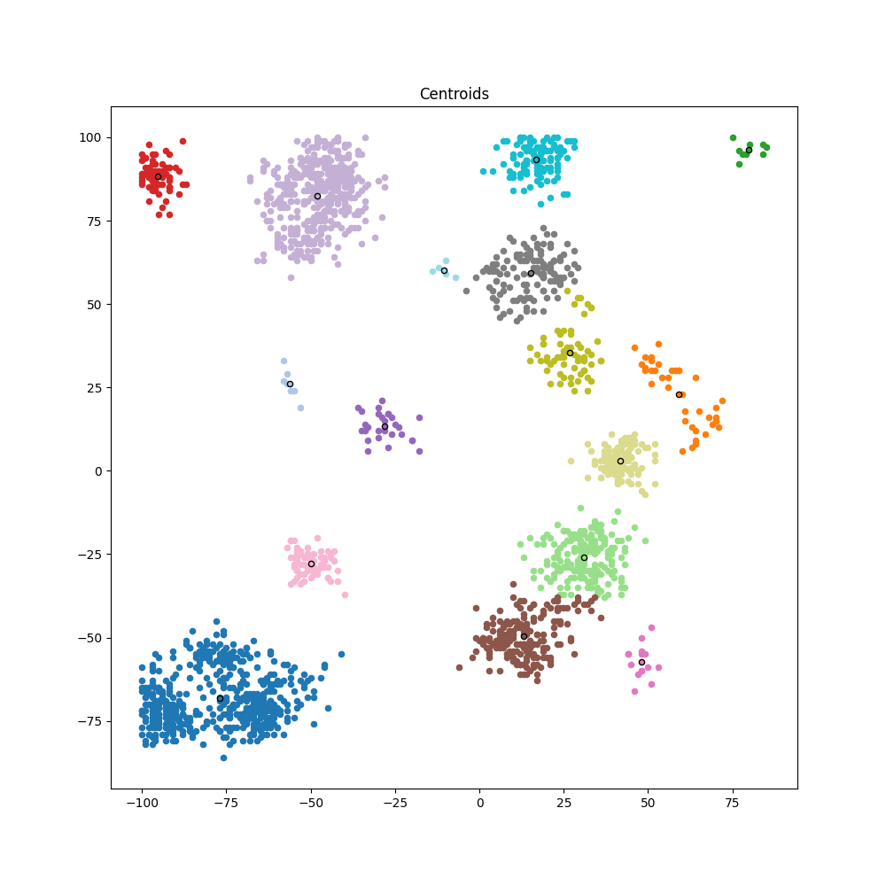
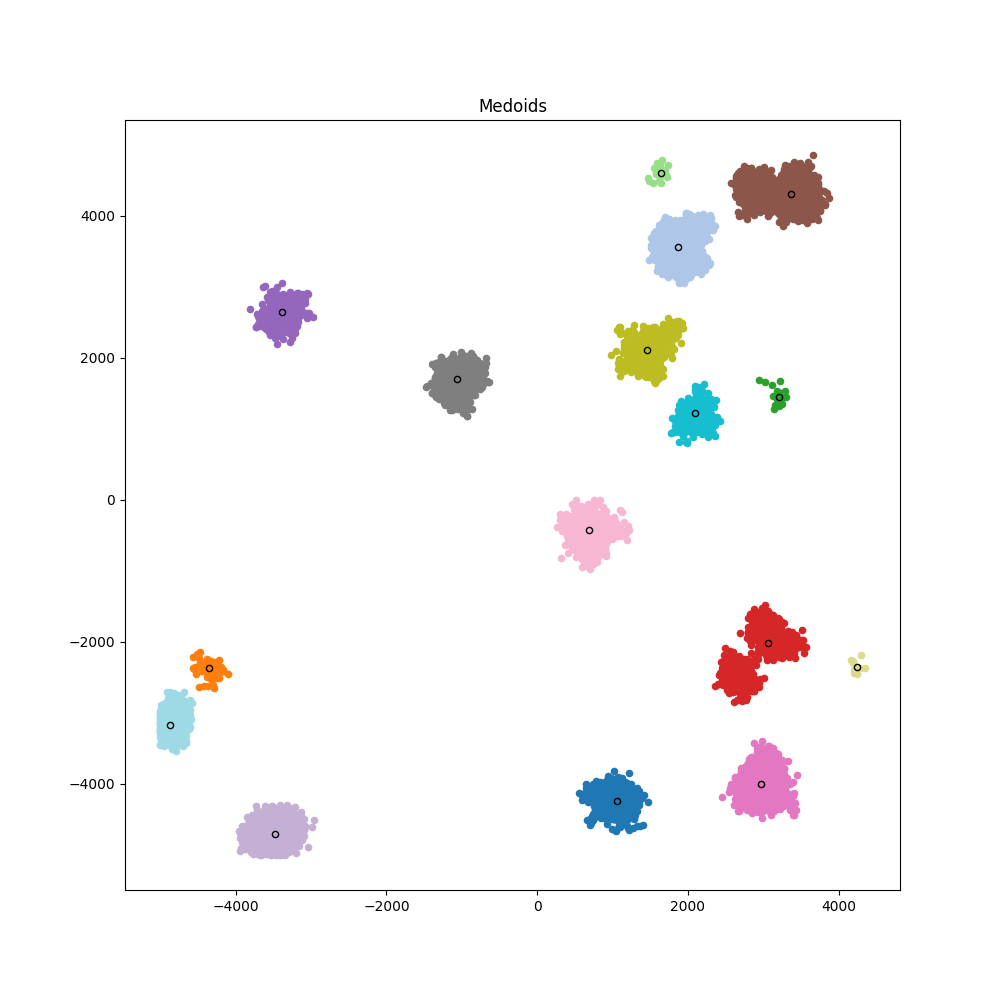

# Agglomerative Clustering

## Overview

This project implements agglomerative clustering algorithms to group points in a 2D space into clusters of nearby points. The clustering is performed using two methods:

- **Centroids**: Using the arithmetic mean of points in a cluster as the center.
- **Medoids**: Using an actual point within the cluster that minimizes total distance to other points.

The goal is to efficiently cluster points, ensuring that clusters have an average distance from their centers below a specified threshold.

<p align="center">
  
  
  
</p>


## Task

We generate a 2D space ranging from -5000 to +5000 in both X and Y dimensions. The task involves:

- **Point Generation**:
  - Generate 20 unique random points within the space.
  - Generate an additional 20,000 points by selecting existing points and adding random offsets between -100 and +100 in both X and Y directions.

- **Clustering**:
  - Implement agglomerative clustering using both centroids and medoids.
  - Evaluate the clustering to ensure that no cluster has an average distance from the center greater than 500.

## Algorithm

The agglomerative clustering algorithm follows these steps:

1. **Initialization**: Start with each point as its own cluster.
2. **Iteration**:
   - Compute distances between clusters using their centers.
   - Merge the pair of clusters with the smallest distance.
   - Update the cluster centers.
   - Repeat until the stopping condition is met.
3. **Stopping Condition**:
   - When the minimum distance between clusters exceeds a maximum distance threshold.

To optimize performance with large datasets, a K-D Tree is used for efficient nearest neighbor searches, reducing computational complexity.

## How to Run

1. **Clone the Repository:**

```bash
git clone https://github.com/yourusername/AgglomerativeClustering.git
```
2. **Run the Main Script:**

- Execute `algorithm.py` to perform clustering.
```bash
python algorithm.py
```

3. **Adjust Parameters:**

- Modify `config.py` to change settings like the number of points, maximum distance, and clustering method.

## Dependencies
The project uses the following Python libraries:

- `numpy` for numerical computations.
- `scikit-learn` for the KDTree implementation.
- `matplotlib` for plotting and visualization.

Install dependencies with:

```bash
pip install numpy scikit-learn matplotlib
```
## Documentation
Detailed documentation and explanations are available in the `doc/` directory.

